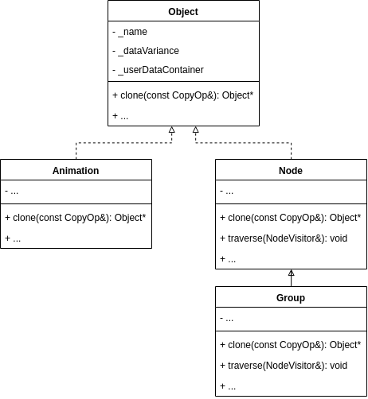
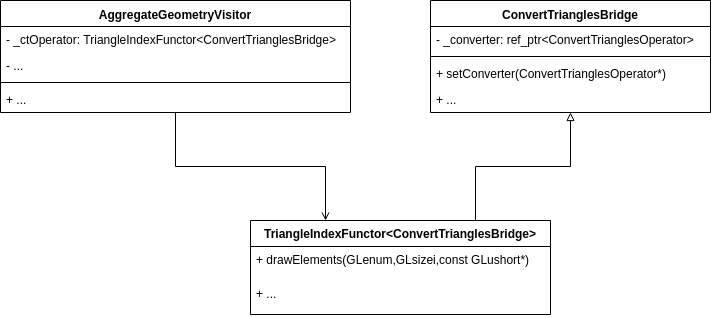

## Задание 1

В качестве предмета для разбора паттернов выбран open-source проект [OpenSceneGraph](https://github.com/openscenegraph/OpenSceneGraph).

### Prototype, Template Method

Паттерн "прототип" реализован в классе [Object](https://github.com/openscenegraph/OpenSceneGraph/blob/bd50af117bed340b14b5bf13da6a8efe893f4ce7/include/osg/Object#L60). В нем объявлен характерный для этого паттерна метод [clone](https://github.com/openscenegraph/OpenSceneGraph/blob/bd50af117bed340b14b5bf13da6a8efe893f4ce7/include/osg/Object#L83). От Object наследуются почти все классы в проекте, в том числе и, например, [Animation](https://github.com/openscenegraph/OpenSceneGraph/blob/bd50af117bed340b14b5bf13da6a8efe893f4ce7/include/osgAnimation/Animation#L28) и [Node](https://github.com/openscenegraph/OpenSceneGraph/blob/bd50af117bed340b14b5bf13da6a8efe893f4ce7/include/osg/Node#L72), и при этом Object используется не только для клонирования объектов, но и для счетчика ссылок и поддержки ввода/вывода для всех объектов, так что вынос операции clone в общий интерфейс не мог не произойти. Применение clone, например, [здесь](https://github.com/openscenegraph/OpenSceneGraph/blob/bd50af117bed340b14b5bf13da6a8efe893f4ce7/src/osgAnimation/AnimationManagerBase.cpp#L75).

Этот же класс реализовывает паттерн "шаблонный метод". В нем содержится реализация многих методов, общих для всех наследников, [например](https://github.com/openscenegraph/OpenSceneGraph/blob/bd50af117bed340b14b5bf13da6a8efe893f4ce7/src/osg/Object.cpp#L54). Часть реализций методов возложена на наследников, например тот же clone. Дабы диаграмма не засорялась, часть, связанная с шаблонным методом, на ней не указана.

### Visitor

Паттерн "посетитель" реализован в классах [Node](https://github.com/openscenegraph/OpenSceneGraph/blob/bd50af117bed340b14b5bf13da6a8efe893f4ce7/include/osg/Node#L72)(element)  и [NodeVisitor](https://github.com/openscenegraph/OpenSceneGraph/blob/bd50af117bed340b14b5bf13da6a8efe893f4ce7/include/osg/NodeVisitor#L81)(visitor). На самом деле, NodeVisitor является посетителем для разных классов, наследованных от Node, но, как можно заметить в [реализации](https://github.com/openscenegraph/OpenSceneGraph/blob/bd50af117bed340b14b5bf13da6a8efe893f4ce7/src/osg/NodeVisitor.cpp#L80), по сути используется только `apply(Node&)`. Использование паттерна оправдано тем, что нужно применять несколько алгоритмов обхода по граффу для разных типов деревьев (наследников Node). [Пример](https://github.com/openscenegraph/OpenSceneGraph/blob/bd50af117bed340b14b5bf13da6a8efe893f4ce7/applications/osgconv/OrientationConverter.cpp#L89) использования. [Пример](https://github.com/openscenegraph/OpenSceneGraph/blob/bd50af117bed340b14b5bf13da6a8efe893f4ce7/include/osg/ComputeBoundsVisitor#L23) наследника NodeVisitor.

### Adapter

Своеобразный адаптер реализован в классе [ConvertTrianglesBridge](https://github.com/openscenegraph/OpenSceneGraph/blob/bd50af117bed340b14b5bf13da6a8efe893f4ce7/examples/osggpucull/AggregateGeometryVisitor.h#L228). Он необходим, для того чтобы использовать шаблонный класс [TriangleIndexFunctor](https://github.com/openscenegraph/OpenSceneGraph/blob/bd50af117bed340b14b5bf13da6a8efe893f4ce7/include/osg/TriangleIndexFunctor#L23), который наследуется от параметра шаблона, в классе [AggregateGeometryVisitor](https://github.com/openscenegraph/OpenSceneGraph/blob/bd50af117bed340b14b5bf13da6a8efe893f4ce7/examples/osggpucull/AggregateGeometryVisitor.h#L221).

